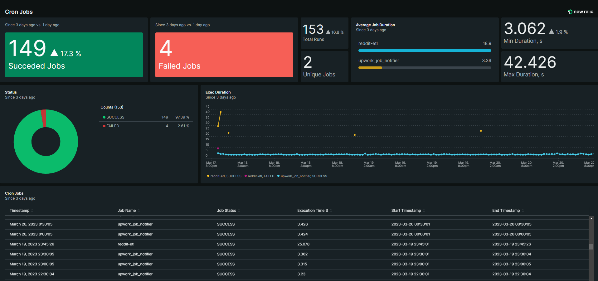
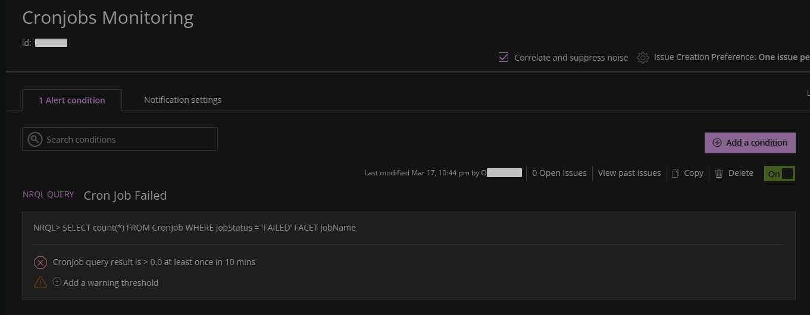

# Cron Job Monitoring with New Relic
Scripts for monitoring the execution of cron jobs and reporting to New Relic Insights API. The monitoring is done using a Bash script that executes a Python script and sends an event to New Relic with information about the job, including the job name, start and end timestamps, execution time, and job status.

To use this script, you will need a New Relic account and an API key.

## Configuration
Before running the script, you will need to configure some variables. These variables are set in the run_job.sh script. You will need to set the following variables:

- `JOB_NAME`: The name of the cron job you are monitoring
- `PYTHON_SCRIPT`: The path to the Python script that the cron job executes
- `LOG_FILE`: The path to the log file for the cron job

The purpose of the `run_job.sh` script is to set up these variables and call the `monitor_cron_job.sh` script with those variables as arguments.

The `monitor_cron_job.sh` script also requires some configuration. You will need to set the following variables:

- `NEW_RELIC_API_KEY`: Your New Relic Insights API key
- `NEW_RELIC_ACCOUNT_ID`: Your New Relic account ID

## Usage
To monitor a cron job, you will need to set up a cron job to execute the run_job.sh script at the desired intervals. To do this, follow the steps below:

1. Open your crontab file: crontab -e
2. Add a new line to the crontab file with the following format: `* * * * * /path/to/run_job.sh > /dev/null 2>&1`
3. Replace /path/to/run_job.sh with the actual path to the run_job.sh script
4. Save and close the crontab file
This will run the `run_job.sh` script every minute. You can adjust the interval as needed by modifying the cron job schedule.

To configure the Python script that the cron job executes, you will need to modify the `PYTHON_SCRIPT` variable in the `run_job.sh` script. Make sure that the Python script has the correct file permissions to be executed by the cron job.

## Cron Monitoring Dashboard

The dashboard code is located in the [dashboard_cron_jobs.json](https://github.com/pelekh-o/newrelic_cron_monitor/blob/main/dashboard_cron_jobs.json) file and is ready to use. Only the `ACCOUNT_ID` field needs to be replaced with the actual value.

## Alert on Failed Jobs

## Credentials
[:octocat:/pelekh-o](https://github.com/pelekh-o)